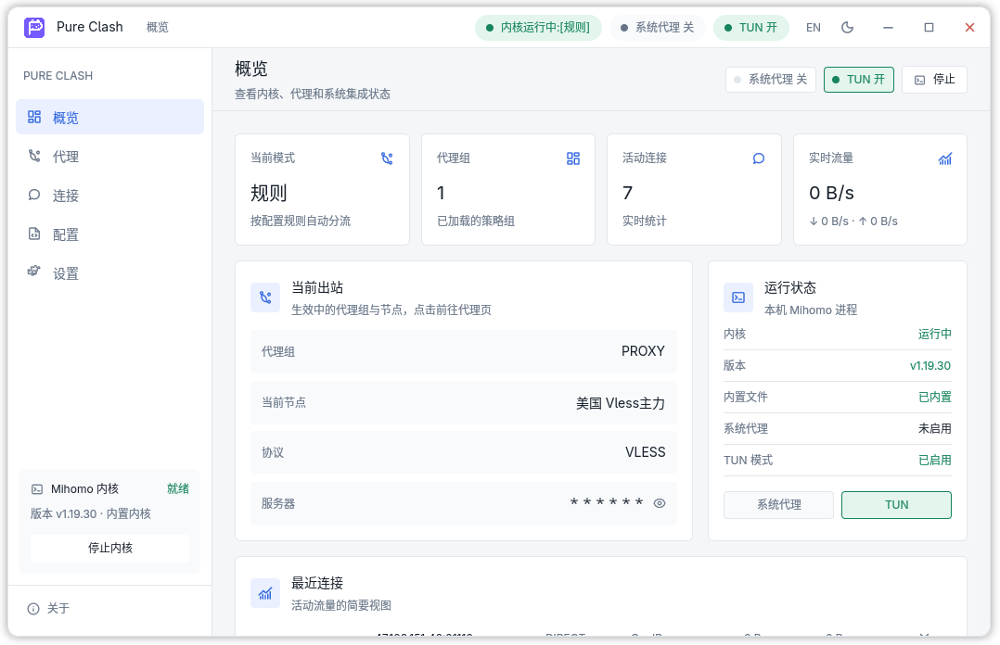
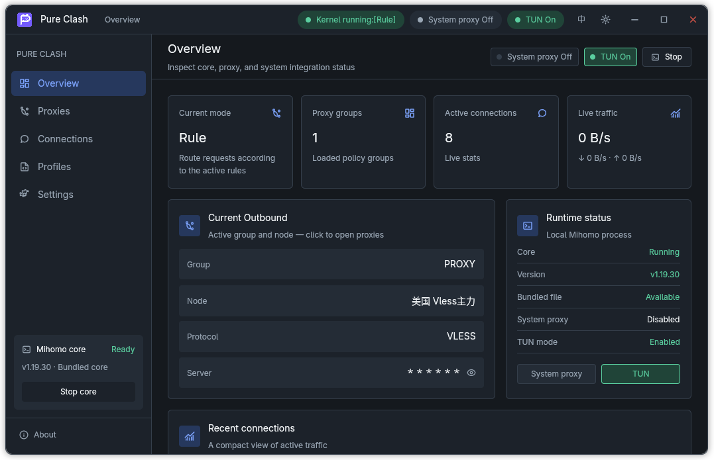

<div align="center">
  
  <h1>Pure Clash</h1>
  <p>使用 Rust 和 Zed GPUI 构建的轻量原生 Mihomo 桌面客户端</p>
  <p><a href="./README.md">English</a> · <a href="./README.zh-CN.md">简体中文</a></p>
</div>

Pure Clash 用清晰、快速的原生界面管理配置订阅、代理组、连接与实时流量，并安全地控制独立运行的 [Mihomo](https://github.com/MetaCubeX/mihomo) 内核——不在 Rust 中重写代理协议栈或规则引擎。

当前支持 Windows x64 与 Linux x64（Wayland / X11）；macOS 预留了目录与资源边界，尚未实现。

## 预览

| 浅色主题 | 深色主题 |
| --- | --- |
|  |  |

## 功能特性

- **内核生命周期**：启动前先用同版本内核执行 `-t` 校验配置；子进程由 Job Object（Windows）或 `PR_SET_PDEATHSIG`（Linux）守护，主进程异常退出时内核同步回收；支持手动启停与托盘退出前的完整清理
- **配置与订阅**：内置默认配置（仅 `DIRECT` 出站）+ URL 订阅下载（结构预检与内核 `-t` 双重校验），支持更新、删除与激活，切换配置真实重启内核
- **代理组与延迟测试**：分组展示订阅节点，规则/全局/直连三种运行模式经 controller 实时切换；支持单节点与整组延迟测试，结果按阈值分色
- **连接与实时流量**：每秒轮询 controller 连接快照，展示进程、目标、链路、规则与上下行流量，支持单条或全部关闭；概览页实时显示网速与活动连接数
- **系统代理**：Windows 写入当前用户 Internet Settings 并经 WinINet 广播生效；Linux 支持 GNOME/Cinnamon 会话（`gsettings`）。开启前原子保存用户原设置，关闭、停内核或异常退出后自动还原
- **TUN 模式**：Windows 经 UAC 提权内核并使用随包 wintun；Linux 参考 Clash Verge Rev 服务模型，首次 `pkexec` 安装 root systemd 服务，此后按 UID 隔离 IPC 启停不再重复授权；TUN 未真实生效时自动回退并提示原因
- **系统集成**：托盘图标（状态多语言同步）、单实例锁、关闭到托盘、深浅色主题与中英文界面
- **极低内存占用**：桌面客户端自身内存通常在 50 MB 以内（不含 Mihomo 内核）

## 界面

五个基础页面加关于页：概览（统计卡、当前出站、运行状态、最近连接）、代理（分组与节点选择、测速）、连接（实时连接列表）、配置（订阅管理）、设置（内核与系统集成、语言主题）。标题栏以徽标同步展示系统代理与 TUN 开关状态。

## 平台支持

| 能力 | Windows x64 | Linux x64 | macOS |
| --- | --- | --- | --- |
| 内核启停与守护 | ✅ | ✅ | 预留 |
| 配置订阅与代理控制 | ✅ | ✅ | 预留 |
| 连接与实时流量 | ✅ | ✅ | 预留 |
| 系统代理 | ✅ | ✅ GNOME/Cinnamon | 未实现 |
| TUN 模式 | ✅ UAC + wintun | ✅ polkit + root 服务 | 未实现 |
| 托盘 | ✅ | ✅ SNI（GNOME 需 AppIndicator 扩展） | 未实现 |
| 单实例锁 | ✅ | ✅ | 未实现 |
| 安装器 | ✅ NSIS per-user | 未实现 | 未实现 |

Linux 使用 XDG 标准目录（`~/.config/pure-clash`、`~/.local/share/pure-clash`）；Wayland 使用带圆角、阴影与缩放边缘的客户端装饰，X11 回退系统装饰。

## 测试覆盖

目前只在以下两个环境完成过实际验证，其他 Windows 版本、发行版与桌面环境未经测试，欢迎反馈：

- Windows 11 x64（MSVC 构建）
- Fedora 44 x64（Wayland / GNOME）

## 快速开始

### 环境要求

- Windows 10/11 x64：Rust stable + MSVC 工具链
- Linux x64：Rust stable（Wayland/X11 会话；TUN 需要 `pkexec` 与可用的 polkit 认证代理）
- PowerShell 7 + NSIS 3.x（仅构建 Windows 安装包时需要）

### 构建运行

```bash
cargo run
```

随包内核与源码一起提交（Windows 为 `kernel/<版本>/pc-mihomo.exe`，Linux 为 `kernel/<版本>/pc-mihomo`），clone 后即可启动真实内核。macOS 二进制暂不入库，需按 `kernel/<版本>/manifest.json` 的 `targets.macos-*` 条目手动下载并校验 SHA-256。

首次启动会在对应平台目录初始化 `config/` 与 `data/`，包括只含 `DIRECT` 节点的默认配置与随机生成的 controller secret。

### Windows 安装包

```powershell
pwsh -NoLogo -NoProfile -File .\packaging\windows\build-installer.ps1
```

产物为 `dist\pure-clash-<版本>-windows-x64-setup.exe`，per-user 安装到 `%LOCALAPPDATA%\Programs\Pure Clash`，不请求管理员权限。

### 开发验证

```bash
cargo fmt --check
cargo check
cargo test
cargo build --release
```

GPUI 仍处于 pre-1.0 阶段，本项目固定使用 `0.2.2`；升级前需核对对应版本的官方示例和变更记录。

## 内核供应链

随包 Mihomo 内核经过版本锁定：`kernel/<版本>/manifest.json` 记录版本、许可证、源码地址，`targets` 按编译目标记录下载 URL、文件大小与 SHA-256；构建脚本与安装器都会校验文件存在性与哈希一致性，不在启动时盲目跟随 GitHub latest。内核统一重命名为 `pc-mihomo`，避免与其他代理客户端的进程重名。

## 安全模型

- controller 仅监听 `127.0.0.1`，secret 为每次安装随机生成的高强度随机数，不写入日志
- 订阅 URL、认证信息与 controller secret 不进入日志与诊断输出；错误详情只展示给当前用户
- Linux TUN 服务以 root 运行锁定版本的内核副本，配置经原子物化到受保护目录并二次校验，拒绝未开启 TUN、非回环监听或路径越界的 bundle
- 系统代理托管状态先原子落盘再修改系统设置，任何异常退出后下次启动自愈

完整设计与边界见[技术方案文档](docs/pure-clash-architecture.md)。

## 路线图

- 规则页与日志/内存监控（controller `/rules`、`/logs`、`/memory`）
- 本地 YAML 配置文件导入（当前仅支持 URL 订阅）
- Linux 凭据存储、系统级安装器与 KDE 等其他桌面的系统代理
- macOS 完整支持（内核守护、窗口行为、TUN 边界）
- 代码签名与更新通道

## 参与贡献

本项目包含大量 AI vibe coding 产出，并在仓库根目录维护 [AGENTS.md](AGENTS.md) 作为 AI 编码代理的工作约定。我们接受并欢迎以 vibe coding 方式产出的 issue 与 PR——只需同样遵守[贡献指南](CONTRIBUTING.md)中的代码约定与验证流程。

## 致谢

- [Zed](https://github.com/zed-industries/zed) 与 GPUI：本项目的界面框架，客户端装饰等实现参考了 Zed 的官方示例
- [Mihomo](https://github.com/MetaCubeX/mihomo)（MetaCubeX）：承担全部网络转发的代理内核
- [Clash Verge Rev](https://github.com/clash-verge-rev/clash-verge-rev)：Linux TUN 服务模型与配置模板的参考实现
- [rust-i18n](https://github.com/longbridge/rust-i18n)、[ksni](https://github.com/frostwind/ksni)、[tray-icon](https://github.com/tauri-apps/tray-icon) 等优秀开源库

## 许可证

本项目代码以 [GPL-3.0](LICENSE) 许可证发布。

随包分发的 Mihomo 内核是未经修改的上游 GPL-3.0 二进制：`kernel/<版本>/` 目录内提供完整许可证文本（`LICENSE`）与第三方组件说明（`NOTICE.md`），`manifest.json` 记录对应版本源码获取地址，安装器随内核一并安装这些文件。

Pure Clash 与 MetaCubeX 无隶属关系，也不代表上游项目对 Pure Clash 提供官方背书。Pure Clash 名称不包含上游限制的 `mihomo` 字样。
